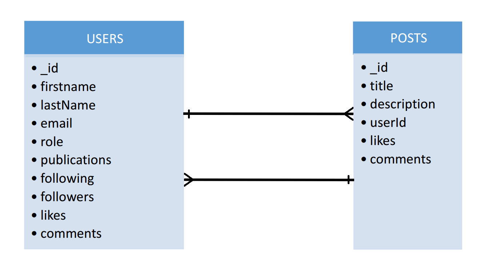

# Social Media API :woman::man:

This is the 5th project of the GeeksHubs Academy Fullstack Developer Bootcamp, showcasing a real-world backend development skills with JavaScript, Express and MongoDB.
The projetc consists in develop the backend of an social media aplication.

---

## Table of Contents :file_folder:

- [Stack 🔧](#stack-wrench)
- [Features 🌟](#features-star2)
- [Local Deployment 🏠](#local-deplyment-house)
- [Live Deployment 📡](#live-deployment-satellite)
- [API Documentation 📑](#api-documentation-bookmark_tabs)
  - [Database Design 📰](#database-design-newspaper)
  - [Endpoints 🔌](#endpoints-electric_plug)
- [Author ✒️](#author-black_nib)
- [Next versions 🔜](#next-versions-soon)
- [Acknowledgements 🎓](#acknowledgements-mortar_board)

---

## Stack :wrench:

<div align="center">


 </div>

---

## Features :star2:

- **Endpoints test:** Thunder collection files.👌
- **User Authentication:** Secure signup and login processes. 🔒
- **Post Creation:** Users can create posts, with date and user profile validation. 📄
- **Admin and SuperAdmin CRUD Endpoints:** Full control over users, posts and services for administrators. 👩‍💼👨‍💼
- **Acurate Documentation:** Fully documented API endpoints. 📚
- **Docker Container:** Easy setup and deployment with Docker. 🐳
- **MongoDB Database with MongoCompass:** Robust database management. 🗄️
- **Live deployment with fl0 and MongoAtlas:** Posibility to deploy the API with remote server and data base. 🗄️
- **Mock Data Generation:** Realistic data generation with Faker.js. 🤖
- **JWT Authentication:** Secure API endpoints with JSON Web Tokens. 🔑
- **Error Handling:** Custom error middleware for handling common API errors. 📝
- **JEST/BABEL testing:** Testing all the diferents endpoints with different possibilies. 🚧

---

## Local Deplyment :house:

#### ⚠️You'll need add a `.env` file based on the provided `.env.local.example` file with the database credentials⚠️

- #### GitHub 🐾

  - Get a copy of the project up and running on your local machine:

    ```sh
    git clone https://github.com/Ferelbue/FSD-PROJECT-5-BACKEND-2.git
    ```

- #### Docker 🐳

  - You'll need Docker installed on your machine and execute:
    ```sh
    $ docker run -d -p 27017:27017 --name mongo -v mongo_data:/data/db -e MONGO_INITDB_ROOT_USERNAME=root -e MONGO_INITDB_ROOT_PASSWORD=root mongo:latest
    ```

- #### MongoDB Workbench 🔧

  - Create and run a new server conection with the port, user and passwors establised.
    ```sh
    $ mongodb://<name>:<password>@127.0.0.1:27017/test?authSource=admin
    ```

- #### Node 📟

  - Run directly with Node:
    ```sh
    npm install             # Install dependecies
    npm run seed            # Poblate DB with mock
    npm run dev             # Run server
    ```

- #### Thunder Client :zap:
  - [Open this file in Thunder client extension and test de API ](./HTTP/thunder-collection_PROJECT_5_LOCAL.json)

---

## Live Deployment :satellite:

#### ⚠️You'll need add a `.env` file based on the provided `.env.online.example` file with the database credentials⚠️

- #### GitHub 🐾

  - Get a copy of the project up and running on your local machine:

    ```sh
    git clone https://github.com/Ferelbue/FSD-PROJECT-5-BACKEND-2.git
    ```

- #### fl0 :curly_loop:

  - Open the following link at an internet browser:
    ```sh
    https://fsd-project-5-backend-2-dev-kjeb.3.us-1.fl0.io/api/healthy
    ```

- #### MongoDB Workbench 🔧

  - Create and run a new server conection with the port, user and passwors establised.
    ```sh
    $ mongodb://<name>:<password>@127.0.0.1:27017/test?authSource=admin
    ```

- #### Node 📟

  - Run directly with Node:
    ```sh
    npm install             # Install dependecies
    npm run seed            # Poblate DB with mock
    npm run dev             # Run server
    ```

- #### Thunder Client :zap:
  - [Open this file in Thunder client extension and test de API ](./HTTP/thunder-collection_PROJECT_5_ONLINE.json)

---

## API Documentation :bookmark_tabs:

- ### Database Design :newspaper:
<div align="center">

</div>

---

- ### Endpoints :electric_plug:

(Click to expand)

<details>
  <summary style="font-weight: bold; font-size: 1.3em;">User Endpoints</summary>
  
##### Authentication 🔒

- `POST /api/auth/register` - Register a new user.
    <details>
      <summary style="font-weight: bold; font-size: 0.8em;">FEATURES</summary>
        - Forbidden to repeat an email address already registered. <br>- Last name not mandatory. 
    </details>
    <details>
      <summary style="font-weight: bold; font-size: 0.8em;">BODY</summary>

        {
          "firstName": "Pepe",
          "lastName": "Perez",
          "email": "pepe@pepe.com",
          "password": "123456"
        }


    </details>

- `POST /api/auth/login` - Login an existing user.
    <details>
      <summary style="font-weight: bold; font-size: 0.8em;">FEATURES</summary>
        - Mandatory to be already registered in the aplication.<br>
        - Mandatory to introduce the email and password successfully.
    </details>
    <details>
      <summary style="font-weight: bold; font-size: 0.8em;">BODY</summary>

        {
          "email": "pepe@pepe.com",
          "password": "123456"
        }


    </details>

##### Users 👤

- `GET /api/users` - Retrieve authenticated user's profile.
    <details>
      <summary style="font-weight: bold; font-size: 0.8em;">FEATURES</summary>
        - Mandatory to be logged previusly.<br>
        - Users role only can see public profiles.<br>
        - Possibility to filter by email, name or last name addind ?email=p&firstName=pep to the endpoint.<br>
        - Possibility to apply pagination adding '?limit=5&page=1' to the endpoint.
    </details>
    <details>
      <summary style="font-weight: bold; font-size: 0.8em;">TOKEN</summary>
        - Mandatory to send the token in the Bearer Authentication.
    </details>

- `GET /api/users/profile` - Retrieve authenticated user's profile.
    <details>
      <summary style="font-weight: bold; font-size: 0.8em;">FEATURES</summary>
        - Mandatory to be logged previusly.<br>
        - Forbiden to see others profiles.
    </details>
    <details>
      <summary style="font-weight: bold; font-size: 0.8em;">TOKEN</summary>
        - Mandatory to send the token in the Bearer Authentication.
    </details>

- `PUT /api/users/profile` - Update authenticated user's profile.
    <details>
      <summary style="font-weight: bold; font-size: 0.8em;">FEATURES</summary>
        - Mandatory to be logged previusly.<br>
        - Forbiden to update others profiles.<br>
        - The user can modify whatever he wants (name, last name, email or password). At the same time or separately.<br>
        - To modify the password had to write two passwords.
    </details>
    <details>
      <summary style="font-weight: bold; font-size: 0.8em;">TOKEN</summary>
        Mandatory to send the token in the Bearer Authentication.
    </details>
        <details>
      <summary style="font-weight: bold; font-size: 0.8em;">BODY</summary>

        { THIS IS AN EXAMPLE. CAN BE MODIFIED SEPARATELY
          "firstName": "Pepe",
          "lastName": "Perez",
          "email": "pepe@pepe.com",

          "password": "123456",
          "newPassword": "654321"
        }

    </details>

- `PUT /api/users/follow/{id}` - Follow a user.
    <details>
      <summary style="font-weight: bold; font-size: 0.8em;">FEATURES</summary>
        - Mandatory to be logged previusly.<br>
        - The user<br>
        - To modify the password had to write two passwords.
    </details>
    <details>
      <summary style="font-weight: bold; font-size: 0.8em;">TOKEN</summary>
        Mandatory to send the token in the Bearer Authentication.
    </details>

##### Post 📄

- `GET /api/posts/own` - Retrieve user's posts.
    <details>
      <summary style="font-weight: bold; font-size: 0.8em;">FEATURES</summary>
        - Mandatory to be logged previusly.<br>
        - Forbiden to see other users posts.
    </details>
    <details>
      <summary style="font-weight: bold; font-size: 0.8em;">TOKEN</summary>
        Mandatory to send the token in the Bearer Authentication.
    </details>

- `GET /api/posts/{id}` - Retrieve details of a specific posts.
    <details>
      <summary style="font-weight: bold; font-size: 0.8em;">FEATURES</summary>
        - Mandatory to send the posts ID in the endpoint.<br>  
        - Forbiden to see other users posts.
    </details>
    <details>    
    <summary style="font-weight: bold; font-size: 0.8em;">TOKEN</summary>
        Mandatory to send the token in the Bearer Authentication.
    </details>

- `PUT /api/posts/{id}` - Update a post.
  <details>
  <summary style="font-weight: bold; font-size: 0.8em;">FEATURES</summary> 
  - Mandatory to be logged previusly.<br> 
  - Forbiden to update other users posts.<br> 
  - Mandatory to know the postId to modify.
  </details>
  <details>
  <summary style="font-weight: bold; font-size: 0.8em;">TOKEN</summary>
  Mandatory to send the token in the Bearer Authentication.
  </details>
  <details>
  <summary style="font-weight: bold; font-size: 0.8em;">BODY</summary>

            {
              "title":"Ager cena aequitas tabgo sonitus.",
              "description":"Accusamus amet suscipit in conspergo. Vilitas cribro vicissitudo vulnero adulatio adficio."
            }

      </details>
  </details>
<details>

- `PUT /api/posts/like/{id}` - Like/unlike a post.
    <details>
      <summary style="font-weight: bold; font-size: 0.8em;">FEATURES</summary>
        - Mandatory to send the posts ID in the endpoint.<br>  
        - Same call for like or unlike post.
    </details>
    <details>    
    <summary style="font-weight: bold; font-size: 0.8em;">TOKEN</summary>
        Mandatory to send the token in the Bearer Authentication.
    </details>

- `PUT /api/posts/comment/{id}` - Comment a post.
    <details>
      <summary style="font-weight: bold; font-size: 0.8em;">FEATURES</summary>
        - Mandatory to send the posts ID in the endpoint.<br>
    </details>
    <details>    
    <summary style="font-weight: bold; font-size: 0.8em;">TOKEN</summary>
        Mandatory to send the token in the Bearer Authentication.
    </details>
     <details>
  <summary style="font-weight: bold; font-size: 0.8em;">BODY</summary>

          {
            "commentary":"So cool your new car!"
          }

      </details>

- `GET /api/posts/timeline` - Retrieve followers posts.
    <details>
      <summary style="font-weight: bold; font-size: 0.8em;">FEATURES</summary>
        - Mandatory to send the posts ID in the endpoint.<br>
        - Only can see followers posts.
    </details>
    <details>    
    <summary style="font-weight: bold; font-size: 0.8em;">TOKEN</summary>
        Mandatory to send the token in the Bearer Authentication.
    </details>


<summary style="font-weight: bold; font-size: 1.3em;">Super-Admin endpoints</summary>

##### USER AND ADMIN ENDPOINTS AND: 👇

##### Users 👩‍💼👨‍💼

- `GET /api/users` - Retrieve any user profile.
    <details>
      <summary style="font-weight: bold; font-size: 0.8em;">FEATURES</summary>
        - Mandatory to be logged previusly and be admin or super-admin.<br>
        - Mandatory to send the user ID in the endpoint.
        - Possibility to filter by email, name or last name addind ?email=p&firstName=pep to the endpoint.<br>
        - Possibility to apply pagination adding '?limit=5&page=1' to the endpoint.
    </details>
    <details>
      <summary style="font-weight: bold; font-size: 0.8em;">TOKEN</summary>
        Mandatory to send the token in the Bearer Authentication.
    </details>

- `PUT /api/users/:id/role` - Update user role.
    <details>
      <summary style="font-weight: bold; font-size: 0.8em;">FEATURES</summary>
        - Mandatory to be logged previusly and be admin or super-admin.<br>
        - Mandatory to send the user ID in the endpoint.
    </details>
    <details>
      <summary style="font-weight: bold; font-size: 0.8em;">TOKEN</summary>
        Mandatory to send the token in the Bearer Authentication.
    </details>
    <details>
      <summary style="font-weight: bold; font-size: 0.8em;">BODY</summary>

      {
        "role": "admin"
      }

- `DELETE /api/users/{id}` - Delete a user by ID.
    <details>
      <summary style="font-weight: bold; font-size: 0.8em;">FEATURES</summary>
        - Mandatory to be logged previusly and be admin or super-admin.<br>
        - Mandatory to send the user ID in the endpoint.
    </details>
    <details>
      <summary style="font-weight: bold; font-size: 0.8em;">TOKEN</summary>
        Mandatory to send the token in the Bearer Authentication.
    </details>

##### Posts 📄

- `DELETE /api/post/{id}` - Delete a post by ID.
    <details>
      <summary style="font-weight: bold; font-size: 0.8em;">FEATURES</summary>
        - Mandatory to be logged previusly and be admin or super-admin.<br>
        - Mandatory to send the user ID in the endpoint.
    </details>
    <details>
      <summary style="font-weight: bold; font-size: 0.8em;">TOKEN</summary>
        Mandatory to send the token in the Bearer Authentication.
    </details>


##### Services 🎨

- `POST /api/services` - Create a new service.
    <details>
      <summary style="font-weight: bold; font-size: 0.8em;">FEATURES</summary>
        - Mandatory to be logged previusly and be super-admin.
    </details>
    <details>
      <summary style="font-weight: bold; font-size: 0.8em;">TOKEN</summary>
        Mandatory to send the token in the Bearer Authentication.
    </details>
    <details>
      <summary style="font-weight: bold; font-size: 0.8em;">BODY</summary>

        {
          "serviceName": "SERVICENAME",
          "description": "SERVICETEXT"
        }

    </details>

- `PUT /api/services/{id}` - Update a service by ID.
    <details>
      <summary style="font-weight: bold; font-size: 0.8em;">FEATURES</summary>
        - Mandatory to be logged previusly and be super-admin.
    </details>
    <details>
      <summary style="font-weight: bold; font-size: 0.8em;">TOKEN</summary>
        Mandatory to send the token in the Bearer Authentication.
    </details>
    <details>
      <summary style="font-weight: bold; font-size: 0.8em;">BODY</summary>

        {
          "serviceName": "SERVICENAME",
          "description": "SERVICETEXT"
        }


    </details>

- `DELETE /api/services/{id}` - Delete a service by ID.
    <details>
      <summary style="font-weight: bold; font-size: 0.8em;">FEATURES</summary> - Mandatory to be logged previusly and be super-admin.
    </details>
    <details>
      <summary style="font-weight: bold; font-size: 0.8em;">TOKEN</summary>
          Mandatory to send the token in the Bearer Authentication.
    </details>


---

## Next versions :soon:

- **Add a frontend** - Users can interact with the API from a web browser.
- **Add notifications** - Users know when their have a liek or a comment.

---

## Author :black_nib:

- **Fernando Elegido** - Full Stack Developer

<div align="center">
<a href="https://github.com/ferelbue" target="_blank"></a> 
<a href = "mailto:ferelbue@gmail.com"></a>
<a href="https://www.linkedin.com/in/fernando-elegido" target="_blank"></a> 
</div>

---

## Acknowledgements :mortar_board:

- Great appreciation to **Geekshubs Academy** for the opportunity to learn and grow as a developer.

---

[Top of document](#social-media-api-womanman)
